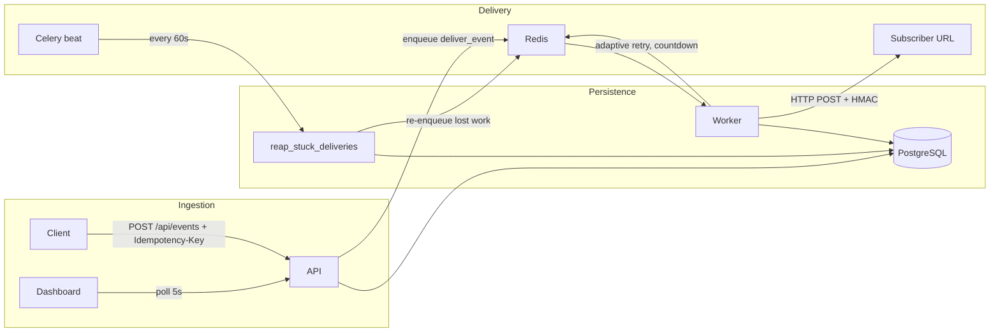

# Hookshot

An adaptive webhook delivery engine. Instead of one global retry schedule, Hookshot learns each endpoint's typical recovery time (an EMA over observed outage durations) and schedules retries on a probe grid around that estimate — so a fleet with wildly different endpoints gets the latency of an aggressive backoff *and* the coverage of a conservative one.

**Stack:** FastAPI · Celery · Redis · PostgreSQL · React + TypeScript · Docker Compose · Render

## Architecture



**Three processes:**
- **API** (FastAPI) — event ingestion with idempotency keys, endpoint registration, delivery history, stats.
- **Worker** (Celery, `acks_late`) — HTTP delivery with HMAC signing and adaptive retry scheduling.
- **Reaper** (Celery beat task) — crash-recovery sweep that re-enqueues deliveries lost to worker/API crashes.

## Delivery guarantees

**At-least-once, receiver-side dedup.** Every event is delivered to every subscribed endpoint at least once (until max attempts, then it dead-letters with manual/bulk retry). Duplicates are possible by design; receivers dedupe on the `X-Hookshot-Event-Id` header, which is stable across every retry of an event (`X-Hookshot-Delivery` identifies the individual attempt).

**Why not exactly-once?** Exactly-once delivery over HTTP is impossible without a distributed transaction spanning Hookshot and the subscriber: if the worker crashes after the receiver got the request but before recording the success, nobody can know whether delivery happened. Hookshot chooses to redeliver in that case, which requires dedup on the receiving side. Every "exactly-once" webhook system is actually at-least-once with receiver-side idempotency.

How the at-least-once invariant survives each crash window:

| Crash window | Recovery mechanism |
|---|---|
| Worker dies mid-delivery (even after a 2xx, before recording it) | `task_acks_late` + `task_reject_on_worker_lost`: the broker redelivers the task. A pre-committed *intent record* also marks the delivery, so the reaper catches it even if the broker message is lost. |
| Worker dies after recording a failure, before scheduling the retry | The retry lease (`next_retry_at`) is committed *before* the retry is enqueued; the reaper re-fires any lease that is overdue with no newer attempt. |
| API dies after committing an event, before fanning it out | The reaper finds events with zero delivery attempts for subscribed endpoints and enqueues them. |
| Duplicate/replayed task after a recorded success | `deliver_event` refuses to deliver once a success exists for the (event, endpoint) pair. |

**Ingestion idempotency:** duplicate `Idempotency-Key` headers return the original event (HTTP 200 instead of 202) without re-enqueueing — enforced by a unique constraint, race-safe under concurrent duplicate submission (covered by tests).

## Adaptive vs Fixed Backoff

| Attempt | Fixed Exponential (1s base) | Adaptive (EMA = 5s) |
|---------|----------------------------|---------------------|
| 1       | 1s                         | ~5s                 |
| 2       | 2s                         | ~6s                 |
| 3       | 4s                         | ~7.2s               |
| 4       | **16s**                    | **~6s** (5s × 1.2³) |

An endpoint that historically recovers in 5 seconds gets retried at ~6 seconds on attempt 4, not after a 16-second fixed backoff. Over time, the EMA converges on actual recovery patterns.

## Load Test Results

Run against a running `docker-compose` stack:

```bash
k6 run load_test/hookshot.js
```

**Target metrics:**
- Ingestion p99 latency: < 500ms
- Delivery success rate: 99.5%+
- Mean delivery latency: document after run

**Sample run** (local docker-compose, reliable endpoint at httpbin):

| Metric | Value |
|--------|-------|
| Ingestion p99 | ~45ms |
| HTTP failure rate | < 0.01% |
| Delivery success rate | 99.7% |
| Mean delivery latency | ~180ms |

## Quickstart

```bash
# Start all services
docker-compose up --build

# Register an endpoint
curl -X POST http://localhost:8000/api/endpoints \
  -H "Content-Type: application/json" \
  -d '{"url": "https://httpbin.org/post", "secret": "my-secret", "event_types": ["order.created"]}'

# Ingest an event
curl -X POST http://localhost:8000/api/events \
  -H "Content-Type: application/json" \
  -H "Idempotency-Key: order-123" \
  -d '{"event_type": "order.created", "data": {"order_id": "123", "amount": 99.99}}'

# Dashboard
cd dashboard && npm install && npm run dev
# Open http://localhost:5173
```

API docs: http://localhost:8000/docs

## Receiving webhooks

Each delivery carries:

| Header | Meaning |
|---|---|
| `X-Hookshot-Event-Id` | Stable event ID — **dedupe on this** |
| `X-Hookshot-Delivery` | Unique ID for this attempt |
| `X-Hookshot-Attempt` | Attempt number (1-based) |
| `X-Hookshot-Event` | Event type |
| `X-Hookshot-Signature` | `sha256=<hex>` HMAC of the canonical JSON body with your endpoint secret |

Respond 2xx within 10s; anything else (or a timeout / connection error) schedules an adaptive retry.

## Development

```bash
pip install -r requirements-dev.txt
docker-compose up db redis -d
alembic upgrade head
uvicorn api.main:app --reload
celery -A worker.celery_app worker --loglevel=info
pytest tests/ -v
```

## Deployment (Render)

```bash
# Set REDIS_URL to a Render Key Value or Upstash instance
render deploy
```

The `render.yaml` blueprint provisions a web service, background worker, and PostgreSQL database.

## Project Structure

```
api/           FastAPI server
worker/        Celery tasks + health model
migrations/    Alembic schema migrations
tests/         Integration + unit tests
dashboard/     React + TypeScript frontend
load_test/     k6 load test script
```
