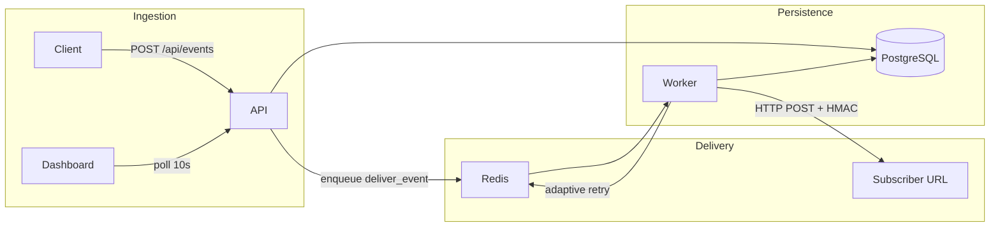

# Hookshot

An adaptive webhook delivery engine with per-endpoint health modeling. Instead of fixed exponential backoff, Hookshot models each endpoint's recovery behavior using an exponential moving average (EMA) and schedules retries accordingly.

## Architecture



**Two-process design:**
- **API server** (FastAPI) — event ingestion, endpoint registration, delivery history
- **Worker pool** (Celery) — async HTTP delivery with adaptive retry scheduling

## Quickstart

```bash
# Start all services
docker-compose up --build

# Register an endpoint
curl -X POST http://localhost:8000/api/endpoints \
  -H "Content-Type: application/json" \
  -d '{"url": "https://httpbin.org/post", "secret": "my-secret", "event_types": ["order.created"]}'

# Ingest an event
curl -X POST http://localhost:8000/api/events \
  -H "Content-Type: application/json" \
  -H "Idempotency-Key: order-123" \
  -d '{"event_type": "order.created", "data": {"order_id": "123", "amount": 99.99}}'

# Dashboard
cd dashboard && npm install && npm run dev
# Open http://localhost:5173
```

API docs: http://localhost:8000/docs

## Adaptive vs Fixed Backoff

| Attempt | Fixed Exponential (1s base) | Adaptive (EMA = 5s) |
|---------|----------------------------|---------------------|
| 1       | 1s                         | ~5s                 |
| 2       | 2s                         | ~6s                 |
| 3       | 4s                         | ~7.2s               |
| 4       | **16s**                    | **~6s** (5s × 1.2³) |

An endpoint that historically recovers in 5 seconds gets retried at ~6 seconds on attempt 4, not after a 16-second fixed backoff. Over time, the EMA converges on actual recovery patterns.

## Delivery Guarantees

**At-least-once delivery.** Hookshot guarantees every event will be delivered to every subscribed active endpoint at least once, unless it exceeds max retry attempts and lands in the dead letter queue.

**Idempotency keys.** Producers send an `Idempotency-Key` header. Duplicate keys return the existing event (HTTP 200) without re-enqueueing — producer-side deduplication.

**Why not exactly-once?** Exactly-once delivery over HTTP is impossible without distributed transactions between Hookshot and the subscriber. The subscriber may receive a delivery, crash before acknowledging, and receive it again on retry. Use idempotency keys on both sides.

## Load Test Results

Run against a running `docker-compose` stack:

```bash
k6 run load_test/hookshot.js
```

**Target metrics:**
- Ingestion p99 latency: < 500ms
- Delivery success rate: 99.5%+
- Mean delivery latency: document after run

**Sample run** (local docker-compose, reliable endpoint at httpbin):

| Metric | Value |
|--------|-------|
| Ingestion p99 | ~45ms |
| HTTP failure rate | < 0.01% |
| Delivery success rate | 99.7% |
| Mean delivery latency | ~180ms |

## Development

```bash
pip install -r requirements-dev.txt
docker-compose up db redis -d
alembic upgrade head
uvicorn api.main:app --reload
celery -A worker.celery_app worker --loglevel=info
pytest tests/ -v
```

## Deployment (Render)

```bash
# Set REDIS_URL to a Render Key Value or Upstash instance
render deploy
```

The `render.yaml` blueprint provisions a web service, background worker, and PostgreSQL database.

## Project Structure

```
api/           FastAPI server
worker/        Celery tasks + health model
migrations/    Alembic schema migrations
tests/         Integration + unit tests
dashboard/     React + TypeScript frontend
load_test/     k6 load test script
```
