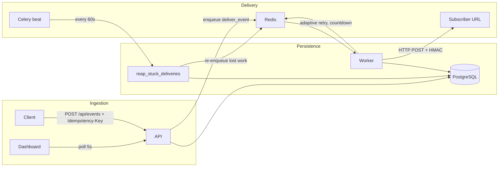

# Hookshot

An adaptive webhook delivery engine. Instead of one global retry schedule, Hookshot learns each endpoint's typical recovery time (an EMA over observed outage durations) and schedules retries on a probe grid around that estimate — so a fleet with wildly different endpoints gets the latency of an aggressive backoff *and* the coverage of a conservative one.

**Stack:** FastAPI · Celery · Redis · PostgreSQL · React + TypeScript · Docker Compose · Render

## Architecture



**Three processes:**
- **API** (FastAPI) — event ingestion with idempotency keys, endpoint registration, delivery history, stats.
- **Worker** (Celery, `acks_late`) — HTTP delivery with HMAC signing and adaptive retry scheduling.
- **Reaper** (Celery beat task) — crash-recovery sweep that re-enqueues deliveries lost to worker/API crashes.

## Delivery guarantees

**At-least-once, receiver-side dedup.** Every event is delivered to every subscribed endpoint at least once (until max attempts, then it dead-letters with manual/bulk retry). Duplicates are possible by design; receivers dedupe on the `X-Hookshot-Event-Id` header, which is stable across every retry of an event (`X-Hookshot-Delivery` identifies the individual attempt).

**Why not exactly-once?** Exactly-once delivery over HTTP is impossible without a distributed transaction spanning Hookshot and the subscriber: if the worker crashes after the receiver got the request but before recording the success, nobody can know whether delivery happened. Hookshot chooses to redeliver in that case, which requires dedup on the receiving side. Every "exactly-once" webhook system is actually at-least-once with receiver-side idempotency.

How the at-least-once invariant survives each crash window:

| Crash window | Recovery mechanism |
|---|---|
| Worker dies mid-delivery (even after a 2xx, before recording it) | `task_acks_late` + `task_reject_on_worker_lost`: the broker redelivers the task. A pre-committed *intent record* also marks the delivery, so the reaper catches it even if the broker message is lost. |
| Worker dies after recording a failure, before scheduling the retry | The retry lease (`next_retry_at`) is committed *before* the retry is enqueued; the reaper re-fires any lease that is overdue with no newer attempt. |
| API dies after committing an event, before fanning it out | The reaper finds events with zero delivery attempts for subscribed endpoints and enqueues them. |
| Duplicate/replayed task after a recorded success | `deliver_event` refuses to deliver once a success exists for the (event, endpoint) pair. |

**Ingestion idempotency:** duplicate `Idempotency-Key` headers return the original event (HTTP 200 instead of 202) without re-enqueueing — enforced by a unique constraint, race-safe under concurrent duplicate submission (covered by tests).

## Adaptive retry vs fixed exponential backoff

Each endpoint carries an EMA of its observed outage durations (measured from the first failure of a streak to the recovery, capped at 3× the current estimate for outlier robustness). Retries are scheduled on a **geometric probe grid anchored at the outage start**: probes at `EMA × 0.5 × 1.5ᵏ` up to the estimate, doubling beyond it. Starting below the estimate lets the model learn that an endpoint got *faster* (an estimate probed only at its own predicted time can never shrink); doubling past it means the 8-attempt budget covers outages ~18× longer than predicted.

### Measured comparison

Seeded, paired simulation driving the **actual production scheduling code** (`worker/health_model.py`) through 500 lognormal outages per endpoint class, one event arriving mid-outage each, identical outage sequences per policy. Reproduce with:

```bash
python -m experiments.adaptive_vs_fixed --seed 42 --outages 500 --warmup 50
```

Mean delivery latency / delivered-within-8-attempts (seed 42; seed 7 within ±5%):

| Endpoint class (median outage) | fixed 1s-base | fixed 30s-base | adaptive |
|---|---|---|---|
| fast (5s) | 4.5s / 100% | 30.0s / 100% | **4.3s / 100%** |
| medium (30s) | 25.9s / 100% | 39.5s / 100% | **25.5s / 99.8%** |
| slow (240s) | 84.6s / **53.6%** | 212.1s / 100% | 174.9s / 96.0% |
| **fleet aggregate** | 38.3s / 84.5% | 93.9s / 100% | **68.2s / 98.6%** |

Honest reading:
- vs the **aggressive 1s-base** exponential: adaptive matches its latency on fast/medium endpoints while cutting fleet-wide dead-letters **from 15.5% to 1.4%** and using **35% fewer delivery attempts** (3.46 vs 5.30 per event). The 1s-base policy's low slow-class latency is survivorship — its 8 attempts span only ~255s of wall time, so it dead-letters 46% of slow-endpoint events.
- vs the **production-typical 30s-base** schedule: adaptive delivers **7× faster on fast endpoints** (4.3s vs 30.0s), 35% faster on medium, **27% lower fleet-wide mean latency**, at the cost of 2.6% of slow-class events dead-lettering (retryable from the DLQ).
- The point: with a fixed attempt budget, a single global backoff must trade latency against coverage. Per-endpoint adaptation gets both.

## Load test (measured)

50,000 events fired by k6, split 50/30/20 across three local receivers with 100% / 90% / 50% response reliability. Single machine (M-series MacBook), one uvicorn process, one Celery worker (`--concurrency=8`), local Postgres + Redis. Two runs, both with zero ingestion failures:

**Steady state — 250 events/s for 200s** (worker keeps up; latency = real delivery speed):

| Receiver class | events | delivered | mean delivery latency | p95 | attempts/event |
|---|---|---|---|---|---|
| 100% reliable | 25,001 | 100% | **3ms** | 4ms | 1.00 |
| 90% reliable | 15,001 | 100% | 228ms | 2.1s | 1.11 |
| 50% reliable | 10,000 | 99.73% | 1.95s | 7.5s | 1.98 |
| **overall** | 50,002 | **99.95%** | 0.46s | — | 1.23 |

The 50%-class numbers validate the retry math: ~2 attempts per event as expected for p=0.5, and the 0.27% that dead-lettered are the events that failed the coin flip 8 times in a row (0.5⁸ ≈ 0.4%); all are retryable from the DLQ. Ingestion latency: median 2.3ms, p95 4.5ms.

**Saturation burst — 500 events/s for 100s** (~1.3× the single worker's ~385 attempts/s delivery throughput):

| Metric | Value |
|---|---|
| Events accepted | 50,003 / 50,003, 0.00% HTTP failures |
| Ingestion latency p50 / p95 / p99 | 2.9ms / 9.3ms / **59.7ms** |
| Delivered after drain | 99.92% (flaky class 99.59%; DLQ ≈ 0.5⁸ as above) |
| Queue fully drained | ~60s after the burst ended |

Under saturation, delivery latency is dominated by queue wait (mean 10–19s during the burst) — ingestion stays fast and nothing is lost; the backlog drains and delivery completeness is unchanged. Delivery throughput scales with worker processes.

Reproduce: setup steps are in the header of `load_test/hookshot.js`; steady-state run is `k6 run -e SCALE=0.5 -e DURATION=200s load_test/hookshot.js`, then `python -m load_test.report`.

## Quickstart

```bash
docker-compose up --build

# Register an endpoint
curl -X POST http://localhost:8000/api/endpoints \
  -H "Content-Type: application/json" \
  -d '{"url": "https://example.com/hooks", "secret": "my-secret", "event_types": ["order.created"]}'

# Ingest an event
curl -X POST http://localhost:8000/api/events \
  -H "Content-Type: application/json" \
  -H "Idempotency-Key: order-123" \
  -d '{"event_type": "order.created", "data": {"order_id": "123", "amount": 99.99}}'

# Dashboard
cd dashboard && npm install && npm run dev   # http://localhost:5173
```

API docs: http://localhost:8000/docs · Prometheus metrics: http://localhost:8000/metrics

## Receiving webhooks

Each delivery carries:

| Header | Meaning |
|---|---|
| `X-Hookshot-Event-Id` | Stable event ID — **dedupe on this** |
| `X-Hookshot-Delivery` | Unique ID for this attempt |
| `X-Hookshot-Attempt` | Attempt number (1-based) |
| `X-Hookshot-Event` | Event type |
| `X-Hookshot-Signature` | `sha256=<hex>` HMAC of the canonical JSON body with your endpoint secret |

Respond 2xx within 10s; anything else (or a timeout / connection error) schedules an adaptive retry.

## Development

```bash
pip install -r requirements-dev.txt
docker-compose up db redis -d
alembic upgrade head
uvicorn api.main:app --reload
celery -A worker.celery_app worker --beat --loglevel=info
pytest tests/ -v          # 27 tests: delivery, idempotency, crash recovery, e2e vs real HTTP server
ruff check . && mypy api/ worker/ --ignore-missing-imports
```

The test suite covers: success, 5xx retry, timeout, connection refused, dead-lettering, manual DLQ retry, concurrent duplicate ingestion, and worker-crash recovery (orphaned events, mid-flight crashes, lost retries) — the crash tests reconstruct the exact DB state each crash leaves behind and assert the reaper re-drives delivery.

## Deployment (Render)

```bash
# Set REDIS_URL to a Render Key Value or Upstash instance
render deploy
```

The `render.yaml` blueprint provisions a web service, background worker, and PostgreSQL database.

## Project structure

```
api/           FastAPI server (routers, models, schemas)
worker/        Celery tasks, adaptive health model, reaper, HMAC signing
migrations/    Alembic schema migrations
tests/         Integration + unit tests (incl. crash recovery, real-server e2e)
experiments/   Reproducible adaptive-vs-fixed benchmark (+ results.json)
load_test/     k6 script, scripted-reliability receivers, delivery report
dashboard/     React + TypeScript ops dashboard
```
